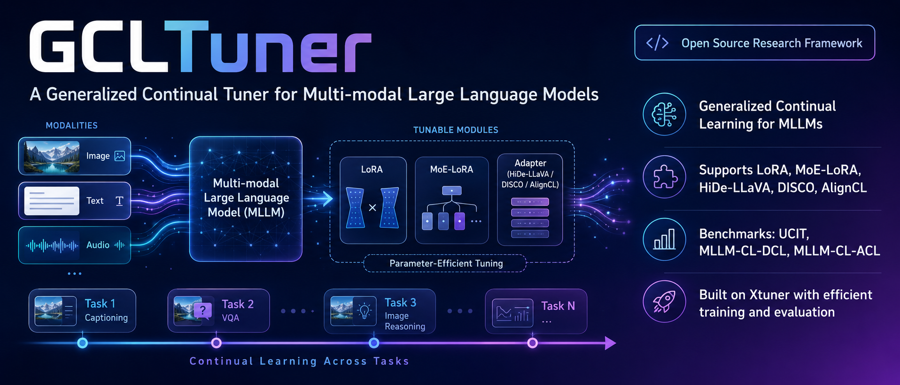

<div align="center">
  <div>
  <h1>GCLTuner: A Generalized Continual Tuner for Multi-modal Large Language Models</h1>
  </div>
</div>


<!-- [//]: # ()
 -->
[](https://github.com/zdyoung0519/gcltuner/stargazers)
[](https://github.com/zdyoung0519/gcltuner/blob/main/LICENSE)
[](https://github.com/zdyoung0519/gcltuner/issues)
[](https://github.com/zdyoung0519/gcltuner/issues)

<div align="center">
  
</div>

## 📖 Introduction
<!-- ***Still working in progress. Please be patient...*** -->
This repository is built to achieve Generalized Continual Learning of Multimodal Large Language Models.

**Main Features**
- The codebase is mainly based on [Xtuner], which supports efficient fine-tuning techniques such as FlashAttention, Tritoon kernels, and DeepSpeed.
- Support different MLLM pre-trained weights, such as Vicuna (No pretrain), LLaVA pre-trained projector, LLaVA instruction-tunend checkpoint. 
- Support different methods and algorithms for continual instruction tuning, including LoRA, MoELoRA, HiDE, DISCO, AlignCL and etc.
- Support different benchmarks and evaluations for CL of MLLMs.


## 🔥 News
- [2026/06/25] [GCLTUner](https://github.com/zdyoung0519/gcltuner) is released.

## ✋ Features

Continual Instruction Tuning (CIT) Methods:
- [x] LoRA: Fine-Tuning with LoRA modules.
- [x] MoELoRA: Fine-Tuning with Mixture of LoRA modules.

Working in process...
<!-- - [ ] [EWC](): LoRA Fine-tuning with EWC penalization.
- [ ] [LwF](): LoRA Fine-tuning with LwF penalization. -->
- [ ] [OLoRA]()
- [ ] [HiDe-LLaVA]()
- [ ] [DISCO]()
- [ ] [AlignCL](): Algnment-centricl Continual Adaptation for MLLMs
<!-- - [ ] [Replay](): Replay previous data. -->
<!-- - [ ] [L2P](): Construct a pool of learnable prompts, and select the prompt that is most relative to the input. -->
<!-- - [ ] [MR-LoRA](https://arxiv.org/abs/2506.05453): Train isolated LoRA modules for tasks and a Router LoRA to select LoRA at inference.
-->

Benchmarks:
- [x] [UCIT](): contains 6 tasks that have small overlap with the LLaVA pre-training data.
- [ ] [MLLM-CL-DCL](https://arxiv.org/abs/2506.05453): Domain Continual Learning (DCL)
- [ ] [MLLM-CL-ACL](https://arxiv.org/abs/2506.05453): Ability Continual Learning (ACL)
<!-- - [ ] [COIN](https://arxiv.org/abs/2403.08350): contains 8 different visual instruction tuning task, including QA, Grounding and e.t.c. 
- [ ] [COIN-Sampled](): a subset of COIN, provided by [Guo, et al.](https://github.com/Ghy0501/HiDe-LLaVA)
- [ ] [COIN-ASD](): 
- [ ] [LLaVA-665k] -->

## 🛠️ Introduciton
### 1.Installation

Clone the repository with git
```angular2html
git clone https://github.com/ZDYoung0519/gcltuner.git
cd gcltuner
```


It is recommended to build a Python-3.10 virtual environment using conda

```
conda create --name gcltuner-env python=3.10 -y
conda activate gcltuner-env
pip install -e '.[all]'
# Or install with tsinghua mirror
pip install -e '.[all]' -i https://mirrors.tuna.tsinghua.edu.cn/pypi/web/simple
```

### 2.Preparation 

#### 2.1 Dataset Preparation
Please refer to ```docs/datasets```.

#### 2.2 Model Preparation
##### 2.2.1 Vicuna
For ```VIcuna-v1.5-7b``` model (```without``` LLaVA pretraining and instruction-tuning), you need to download download `vicuna-7b-v1.5` and `clip-vit-large-patch14-336`:
```
huggingface-cli download lmsys/vicuna-7b-v1.5 --local-dir $YOUR_MODEL_PATH/lmsys/vicuna-7b-v1.5
huggingface-cli download openai/clip-vit-large-patch14-336 --local-dir $YOUR_MODEL_PATH/openai/clip-vit-large-patch14-336
```
For ```LLaVA-v1.5``` model ```with pretrained MLP```  weights, you need to run the fowllowing cmd to download the pre-training weights and covert it into `xtuner` format:
```
# download llava-v1.5-mlp2x
huggingface-cli download liuhaotian/llava-v1.5-mlp2x-336px-pretrain-vicuna-7b-v1.5  \ 
--local-dir $YOUR_MODEL_PATH/liuhaotian/llava-v1.5-mlp2x-336px-pretrain-vicuna-7b-v1.5

# convert it into xtuner format
python ./gcltuner/tools/convert_projector_to_xtuner.py \
 --src_path $YOUR_MODEL_PATH/liuhaotian/llava-v1.5-mlp2x-336px-pretrain-vicuna-7b-v1.5/mm_projector.bin  \
 --dst_path /$YOUR_MODEL_PATH/liuhaotian/llava-v1.5-mlp2x-336px-pretrain-vicuna-7b-v1.5/mm_projector_xtuner.pt
```
If you want to use the `full weights` of `LLaVA-v1.5`, you need to run the fowllowing cmd to download and covert them into `xtuner` format:
```
# download llava-v1.5-mlp2x
huggingface-cli download liuhaotian/llava-v1.5-mlp2x-336px-pretrain-vicuna-7b-v1.5  --local-dir $YOUR_MODEL_PATH/liuhaotian/llava-v1.5-mlp2x-336px-pretrain-vicuna-7b-v1.5

# convert it into xtuner format
python gcltuner/tools/covert_huggingface_llava_projector_to_xtuner_type.py \
  --src_path $YOUR_MODEL_PATH/llava-v1.5-mlp2x-336px-pretrain-vicuna-7b-v1.5/mm_projector.bin \
  --dst_path $YOUR_MODEL_PATH/llava-v1.5-mlp2x-336px-pretrain-vicuna-7b-v1.5/mm_projector_xtuner.pt
```
NOTE: After downloading them, you need to modify the path in `gcltuner/data.py`.


### 3. Train And Evaluate
We provide the training and evaluation scripts in ```projects/${method_name}/experiments/{$exp_name}```. For example, if you want to perform `LoRA` finetuneing on `UCIT` benchmarks, with `LLaVA-v1.5-7b` as initialization, run the following cmd:
```
bash ./projects/lora/experiments/ucit_llava_v15_7b_inst/run_all.sh
```
The naming convention for the exp_name is as follows:
```
ucit_llava_v15_7b_inst
{benchmark}_{architecture}_{version&model_size}_{pretrains}
```
This represents that the MLLM is initialized with the LLaVA-v1.5-7B model that has undergone both pretraining and instruction fine-tuning.

The outputs are organized as:
```
# The training log and model weights
work_dirs/ucit_llava_v15_7b_inst/lora/task${t}

# the evaluation results on task i after fintuning task j
work_dirs/ucit_llava_v15_7b_inst/lora/eval/task${i}/task${j}

# Overoll continual performance
work_dirs/ucit_llava_v15_7b_inst/lora/eval/metric_matrix.csv
```


## 🤝 Acknowledgement
This repository is built upon the following projects：
- [Xtuner]()
- [LLaVA](https://github.com/haotian-liu/LLaVA)
- [COIN]()
- [MCitLib]()

We sincerely thank these contributors.


## 🖊️ Citation


```bibtex
@misc{2025gcltuner,
    title={GCLTuner: A Generalized Continual Tuner for Multi-modal Large Language Models},
    author={Dongyang Zhang, et al.},
    howpublished = {\url{https://github.com/zdyoung/gcltuner}},
    year={2026}
}

```

<!-- @misc{2025aligncl,
    title={AlignCL},
    author={Dongyang Zhang, Junmin Liu et al.},
    howpublished = {xxxx},
    year={2025}
} -->


## License

This project is released under the [Apache License 2.0](LICENSE). Please also adhere to the Licenses of models and datasets being used.
